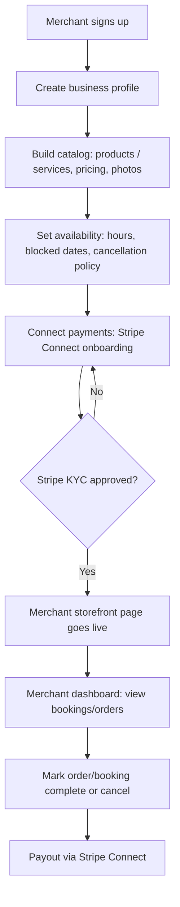
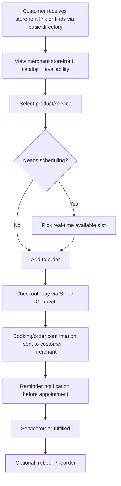
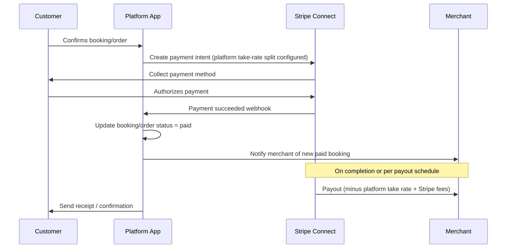
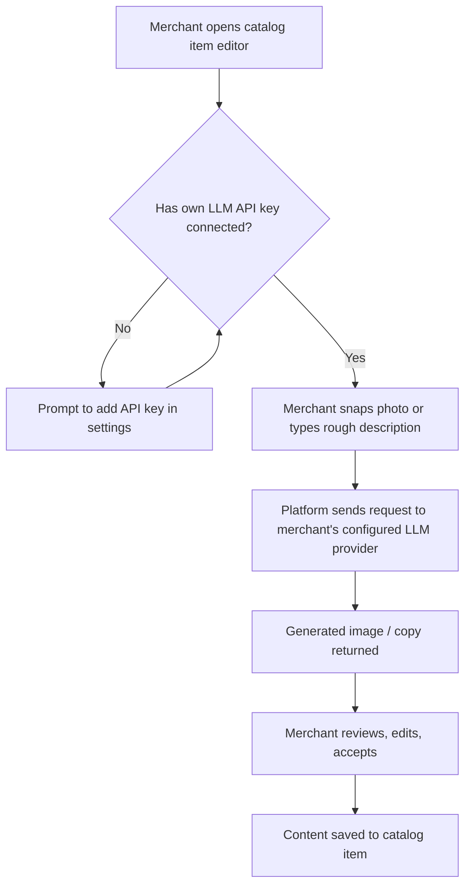
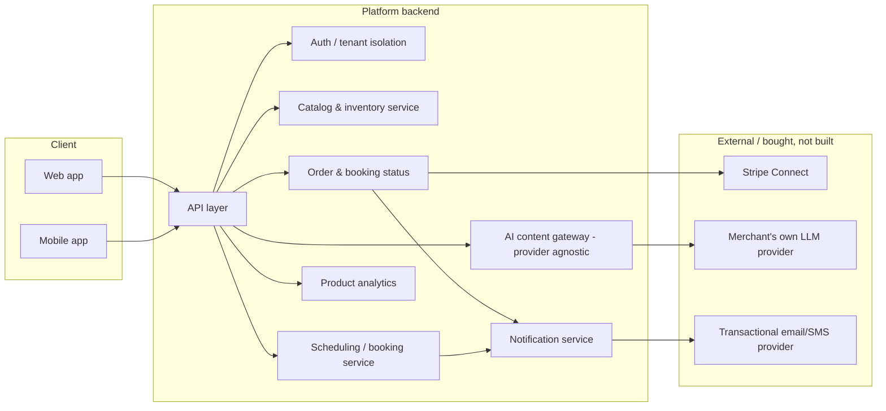

# Legacy: MVP Application Flow Diagrams (moved from the planning folder)

**Status: partially superseded — read this banner before the diagrams below.**

This document was written before `technical_development_plan/` (`docs/design/00`–`14`) existed, back when the product scope was products + services only (no rentals) and the plan assumed hiring an external technical partner rather than Claude building directly. It is kept for its **flow diagrams**, which are still a useful illustration of the core user journeys — but the following parts of the original document are **no longer current** and should not be used for planning:

- Its own "EOY build sequence" table (§7) — superseded by `docs/BUILD_CALENDAR.md`, which has real per-card estimates (~473.5 hours across 176 cards) rather than a hand-waved 16-week table.
- Its gate names (G1, G4 as used in §6/§7) — these predate the actual phase plan's gates (G0–G10, `docs/design/01_phasing_and_mvp_definition.md`) and do not map onto them.
- Its "technical partner" hiring assumption — superseded by the decision that Claude executes the build directly (see `CLAUDE.md`, "Operating model").
- Its diagrams do not show the **rentals** mode (products/services only) — rentals were added to scope after this document was written. See `docs/design/03_domain_model_and_schema.md` for the real three-mode model.
- Its Auth flow references are generic ("Auth / tenant isolation") and predate ADR-002's native-auth decision — see `docs/adr/ADR-002-authentication-provider.md` for the actual authentication design.
- Cross-references to sibling business-planning files (business plan, wedge-selection doc, product-design doc) have been left as plain text below rather than links, since those files live outside this repository in the planning folder, not here.

**Use this document only for the diagram shapes below** (still a reasonable sketch of merchant onboarding, customer checkout, and the payment sequence) — not for scope, gates, or timeline, all of which are authoritative elsewhere in `docs/design/` and `docs/BUILD_CALENDAR.md`.

---

*Original purpose note (historical): a high-level visual reference for building the Phase 1 MVP (storefront + scheduling + payments, single vertical, single city — see the business plan and project context in the planning folder). Target at the time of writing: a fully functioning application by end of year (2026-09-07 → 2026-12-31, ~16 weeks) — since superseded by the real per-card estimate above.*

---

## 1. Merchant-side flow (storefront + scheduling setup)

*Note: this diagram predates rentals — a real merchant onboarding flow now also includes setting up rental inventory (`inventory_units`) and per-unit deposit configuration; see `docs/design/03`.*

## 2. Customer-side flow (discovery-lite → booking → payment)

**Note:** discovery/marketplace search (customers browsing without already knowing the merchant) is explicitly deferred — this is a link-sharing or a minimal directory only, not search, per `docs/design/01_phasing_and_mvp_definition.md`.

## 3. Payment and payout sequence (Stripe Connect)

*This still matches the real design — see `docs/design/06_api_contracts_and_service_boundaries.md` (webhook handling) and `docs/design/05` (deposit authorizations use a related but distinct flow for rentals).*

## 4. AI content-generation flow (BYO-LLM)

*Not in the current MVP phase plan (`docs/design/01`) — this is a possible later feature, not a Phase 1–7 deliverable. Kept here as a reference sketch only.*

## 5. System architecture (component view)

*The real architecture (`docs/design/02_ADR_001_stack_decision.md`, `docs/design/11_environments_and_aws_target_architecture.md`) is more specific than this sketch (Fastify API, Drizzle/Postgres, ECS Fargate, etc.) — this diagram is still directionally correct at the component-boundary level.*
